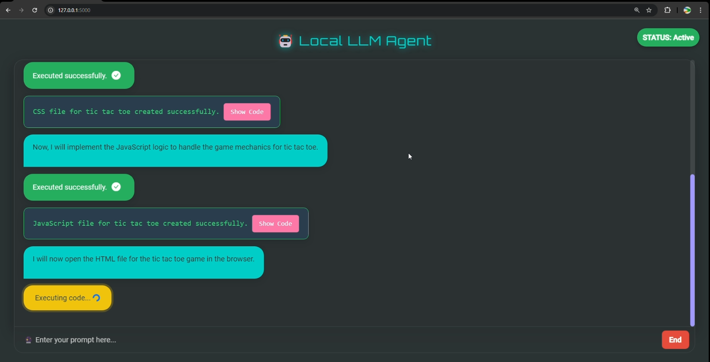
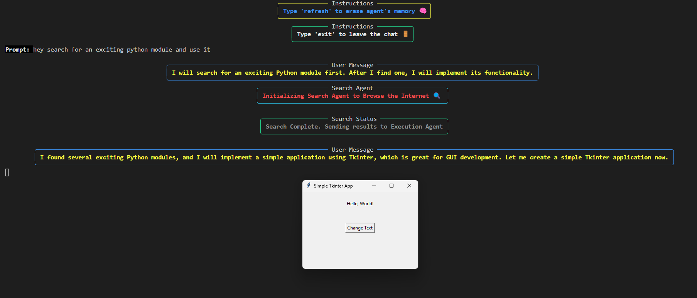
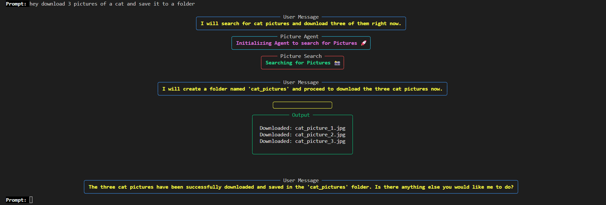
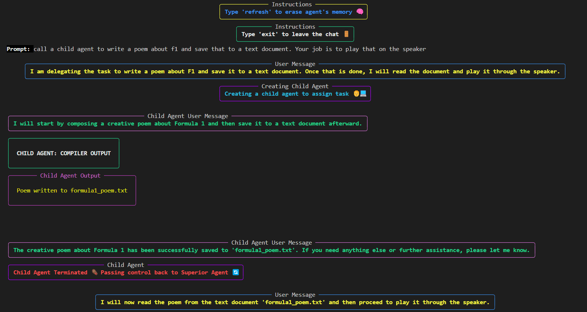

# Local LLM Agent (Work In Progress)

## `What is LLM Agent?`
The Local LLM Agent is an AI-powered tool designed to automate complex and time-consuming tasks directly on your device. By leveraging OpenAI's API, this agent can autonomously complete entire workflows, saving you hours of manual effort. The agent is capable of recursive self-calling, allowing it to self-correct and achieve the tasks presented in the query.

### `Click on the thumbnail below to watch a video of the working of the application (UI version)`
[](https://vimeo.com/1014757362?share=copy)
- ### `Example Usage (Terminal Version)`



## `Multi-Agentic System:`
This system employs a multi-agentic architecture where the main agent can spawn child agents to handle specific tasks. Child agents are executed in separate threads to ensure they don't contaminate the main agent's memory. After completing their designated task, the child agent returns a summary and then terminates itself, ensuring efficient memory and task management. The main agent can invoke child agents automatically whenever needed.

- ### `Child Agents for Task Delegation:`
  When a task requires specific execution, the main agent can autonomously create and delegate to a child agent. This child agent is designed to perform a single task, report the results, and terminate itself, thus maintaining the main agent's memory integrity.

   ``Here is an example showcasing explicit invocation of a child agent for demonstration purposes, though it can do this automatically when needed:``

   

# `Current Features and Capabilities`

The Local LLM Agent is capable of handling a wide variety of tasks, from coding and file management to data analysis and internet searches. Below is an overview of its current functionalities:

### 1. `Application Development`
- **Develop Web Applications & Games:** The agent can design and build fully functional web applications and games, saving them directly to your system.
  - **Example:** Create a clock web app or a browser-based game.

  **Prompt:** `Create a browser based clock using HTML, CSS and JS. It must look like an actual clock, round in shape with moving hands. Also display the time in digits beside the clock`
      
      
   **Prompt:** `Create a web based calculator using HTML, CSS and JS with history that records all the previous calculations. Beautify the application by giving it a cyborg theme.`
      
   
### 2. `Code Debugging & Self-Correction`
- **Automatic Code Debugging:** The agent can analyze, debug, and fix code by interacting with your local environment.
- **Self-Correction:** The agent evaluates compiler outputs, rewrites faulty code, and re-executes it to achieve success.
  - *Example:* Automatically correct errors in a Python script and rerun it.

### 3. `File System Interaction`
- **Manage Files Seamlessly:** The agent can search, update, delete, and create files/folders on your system. The agent can also open files as well.
  - *Example:* Merge multiple PDF files into one or reorganize project directories.
- **Local Environment Access:** It interacts with Python environment to run scripts.
### 4. `Version Control Integration`
- **GitHub Integration:** Push code changes, create repositories, or manage version control seamlessly.
  - *Example:* Automatically push your latest project updates to GitHub.
### 5. `Data Analysis`
- **Analyze Data Locally:** The agent can analyze CSV or other datasets and generate charts or visualizations.
  - *Example:* Create a line graph comparing sales data over time or analyze machine learning models.

   **Prompt:** `There is .csv in the current folder, find it, analyse the data and produce two intuitive data representations.`
   

### 6. `Internet Search & Research`
- **Internet Search Functionality:** The agent can search the web for real-time information, news, or technical resources.
  - *Example:* Retrieve the latest trends in AI research or solutions to specific coding issues or retrieve information about specific python frameworks.

  **Prompt:** `Retrieve the price data of bitcoin for the last 100 days and plot a graph`
     ### `Graph:`
   
   The graph represents price trends, helping users make informed decisions.


   #### The agent does 3 things:
   1. `Browse the web to identify a module for retrieving price data.`
   2. `Download and Use the module to fetch historical price information.`
   3. `Plot the retrieved data on a graph for visual analysis.`

- **Research & Summarization:** Conduct research on any topic and summarize the findings or draft blog posts.
  - *Example:* Generate a blog post summarizing recent advancements in AI-driven automation.
  
### 7. `Download pictures`
- **Search and download pictures:** The agent has a picture tool using which it can download pictures.

## `Automating Menial Tasks`
The Local LLM Agent is not just for high-level tasks; it excels at automating day-to-day repetitive activities, saving you hours of manual work.

SOME EXAMPLES ARE:
- `PPT Preparation:`Prepare a PPT about a topic within seconds with just a simple prompt
- `PDF Merging:`Combine multiple PDF files into one with a simple command.
- `URL Shortening:`Shorten long URLs for sharing.
- `File Sorting:`Automatically move, rename, or delete files based on predefined conditions (e.g., file type, date created).

---
## `Comprehensive Prompts`
You can ask the Local LLM Agent to perform virtually any task by providing a comprehensive and clear prompt. Whether you need to develop an application, shorten URLs, or merge files, the agent will autonomously work through the task until it is completed successfully.

## `A few more examples of its work by using the comprehensive prompt approach:`
## `Example Output: Tic Tac Toe with Smart AI Opponent`
With just a single prompt, the Local LLM Agent can create a fully functional Tic Tac Toe game featuring a smart AI opponent.


## `Example Output: Analyze stock trends and predict the price of stocks/crypto for the next day`
The Agent provides investment advice by thoroughly examining stock trends, plotting graphs, and running ML models to predict the stock price for the coming days.


## How to Use the Local LLM Agent

To start using the Local LLM Agent, follow these steps:

1. **Clone the Repository**: First, clone the repository to your local machine using the following command:
   ```bash
   git clone https://github.com/vishnugamini/LLMAgent
2. **Navigate to the Project Directory**: Move into the project directory:
   ```bash
   cd local-llm-agent
3. **Create a `.env` File**: Create a `.env` file in the root directory of the project and include your OpenAI and Preplexity(to browse the internet(optional)) API keys. The `.env` file should look like this:
   ```bash
   OPENAPI_KEY = "your-openai-api-key"
   PERPLEXITY_API = "your-perplexity-api-key"
4. **Install Dependencies**: Install the necessary Python dependencies by running:
   ```bash
   pip install -r requirements.txt
5. **Run the Agent**: Start the agent by executing the following command:
   
  ### `TERMINAL VERSION`
     ```bash
     python interact_AGENT.py
     ```

  ### `UI Version`
     ```bash
     python app.py
     ```
7. **Interact with the Agent**: Once the agent is running, you can start interacting with it through the terminal. You can give it tasks like "Create a Tic Tac Toe game" or "Debug this piece of code," and the agent will handle everything from development to debugging and even self-correction.

## `Example Workflow`

Here, The agent is tasked to create a ppt about AI with a beautiful template. 

1. `Starts of with a web search about templates for ppt`
2. `Tries to create a ppt using a python framwork but realizes that the framework does not exist`
3. `Uses the install tool to install the python-pptx framework`
4. `proceeds to create the ppt`
### `OUTPUT: `


### `Provides a multi-page ppt about AI with a beautiful template`


