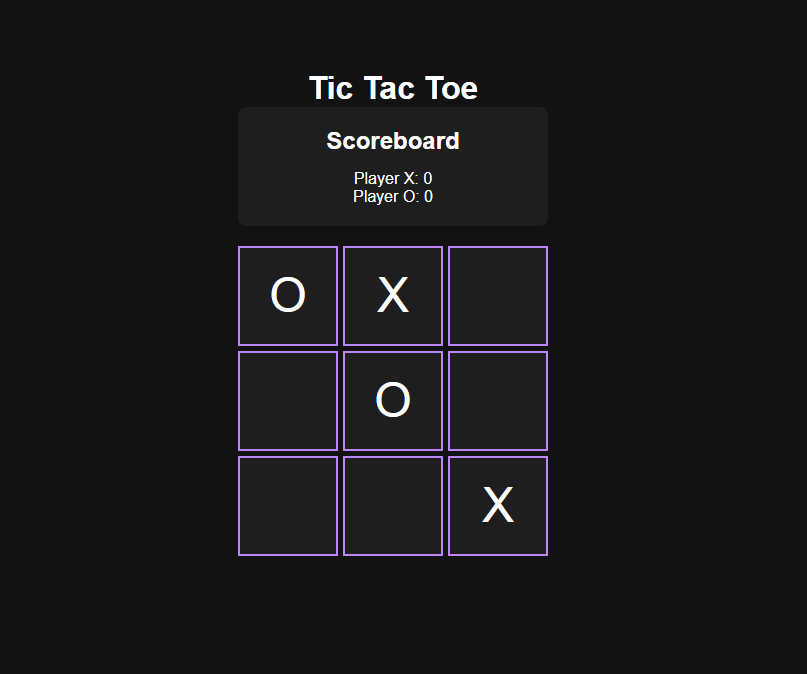
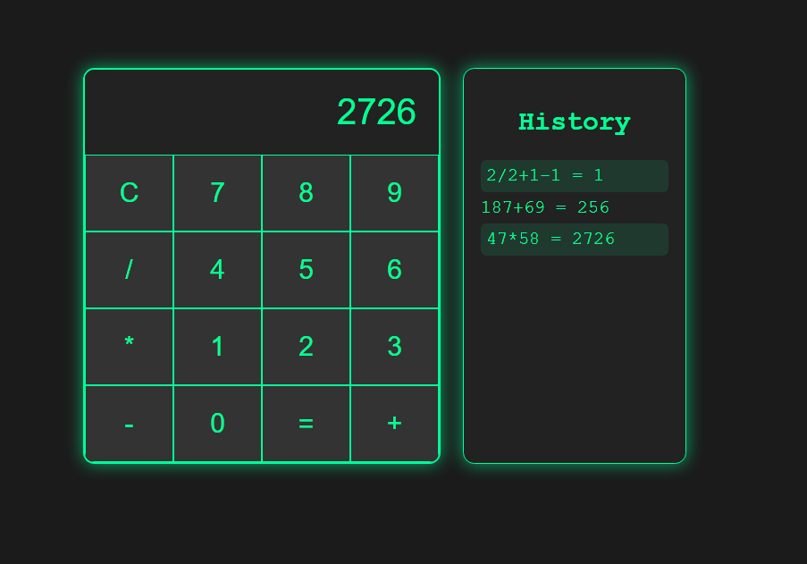
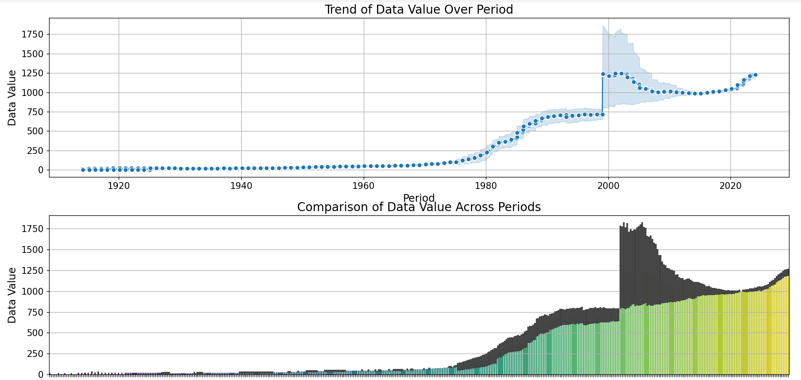
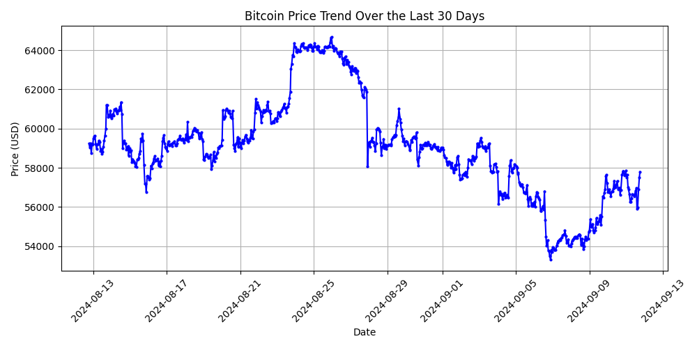

# Local LLM Agent (Work In Progress)

## What is an LLM agent?
This is a tool that automates workflows on your device. It achieves end-to-end tasks which would require hours of human work which could be automated with a comprehensive prompt. This tool recursively calls itself to achieve the task presented to it in the query. Some examples are listed below for your reference. 

This Local LLM Agent is designed to run directly on your system using an OpenAI API key. Currently, it's in its early stages, with ongoing development to bring more features and improvements. Here's what the agent can do so far:

- **Develop Applications:** Build web applications and games, then save them directly on your system.
- **Code Debugging:** Analyze and debug its own code.
- **Self-Correction:** Automatically call itself, evaluate compiler outputs, and rewrite code to fix any issues.
- **Local Environment Access:** Interact with Python and CMD local environments for versatile task execution.
- **File System Interaction:** Find, update, and delete files/folders on your system, providing seamless file management.
- **Version Control Integration:** Push code directly to GitHub (Yes, you read that right!).
- **Data Analysis:** The Agent can analyze csv files and create intended graphs for intuitive data representation.
- **Internet Search Functionality:** The Agent can search the internet for real-time information to assist with tasks.
- **Research:** The Agent can research about a specific topic by browsing the internet and gather information that could then be summarized/coverted into a blog post/etc.

## Example Usage


Stay tuned for more exciting features and enhancements in the near future!

## Example Output: Tic Tac Toe with Smart AI Opponent

With just a single prompt, the Local LLM Agent can create a fully functional Tic Tac Toe game featuring a smart AI opponent.



## Example: Retrieve and Plot Stock/Crypto Prices

In this example, the Agent browses the web to find a suitable module for retrieving stock or crypto prices over the past few days and plots a graph.

The agent does 3 things:
1. Browse the web to identify a module for retrieving price data.
2. Use the module to fetch historical price information.
3. Plot the retrieved data on a graph for visual analysis.

### Graph:


The graph represents price trends, helping users make informed decisions.


## Example Output: Clock 


## Example Output: Calculator



## Example Output: Create data representations from CSV files

The Agent can analyze the data and create Intuitive data representations



## Example Output: Analyze stock trends and predict the price of stocks/crypto for the next day 
The Agent provides investment advice by throughly examining the stock trends, plots graphs, runs ML models to predict the stock price for the coming days



## How to Use the Local LLM Agent

To start using the Local LLM Agent, follow these steps:

1. **Clone the Repository**: First, clone the repository to your local machine using the following command:
   ```bash
   git clone https://github.com/vishnugamini/LLMAgent
2. **Navigate to the Project Directory**: Move into the project directory:
   ```bash
   cd local-llm-agent
3. **Create a `.env` File**: Create a `.env` file in the root directory of the project and include your OpenAI and Preplexity(to browse the internet(optional)) API keys. The `.env` file should look like this:
   ```bash
   OPENAPI_KEY = "your-openai-api-key"
   PERPLEXITY_API = "your-perplexity-api-key"
4. **Install Dependencies**: Install the necessary Python dependencies by running:
   ```bash
   pip install -r requirements.txt
5. **Run the Agent**: Start the agent by executing the following command:
   ```bash
   python interact_AGENT.py
6. **Interact with the Agent**: Once the agent is running, you can start interacting with it through the terminal. You can give it tasks like "Create a Tic Tac Toe game" or "Debug this piece of code," and the agent will handle everything from development to debugging and even self-correction.


