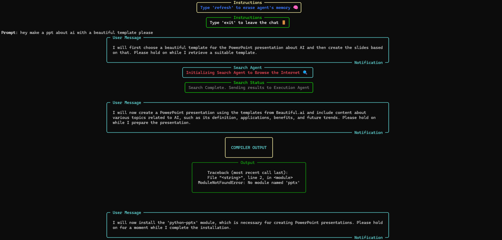
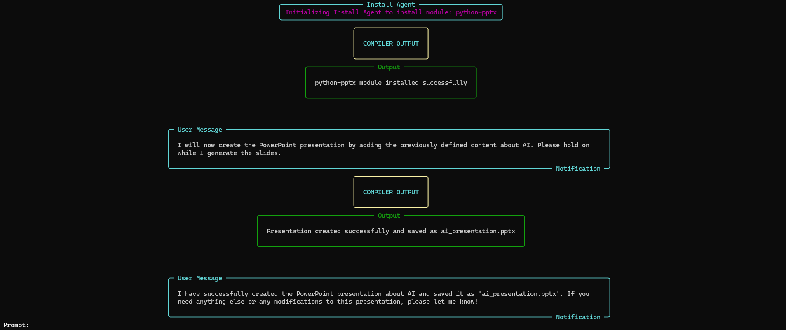
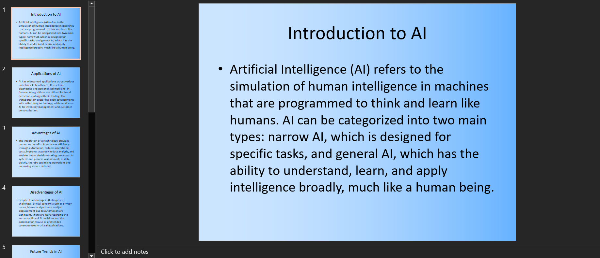

# `Local LLM Agent`
### The Local LLM Agent is an AI-powered tool designed to automate complex and time-consuming tasks directly on your device. By Levaraging the capabilites of LLM's ability to `attend` to relavant chunks of data, this tool can autonomously complete entire workflows, saving you hours of manual effort. The agent is capable of recursive self-calling, allowing it to self-correct and achieve the tasks presented in the query.

## `How is it different from other Agents?`
### *My tool encompasses a system similar to that of a chatbot. No external coding expertise is required nor explicit creation of various agents is required. Just one single prompt will kick off the workflow, and the agent will continuosly work towards fullfilling the user's request, And just like a chatbot, you can look at the work done and get it modified if you are dissatisfied*

### `The Agent can be executed in 2 ways:`
1. GUI (Provides intermediary outputs at every step)
2. TERMINAL (Light Weight Alternative)

### Let's look at a video of one aspect of its functionality.

https://github.com/user-attachments/assets/0d4390af-7ed9-450b-b5e2-7a5ec12b630c

# `Workflow Diagram`


# `Current Features and Capabilities`

### 1. `Application Development`
- **Develop Web Applications & Games:** The agent can design and build fully functional web applications and games, saving them directly to your system.

### 2. `Code Debugging & Self-Correction`
- **Automatic Code Debugging:** The agent can analyze, debug, and fix code by interacting with your local environment.
- **Self-Correction:** The agent evaluates compiler outputs, rewrites faulty code, and re-executes it to achieve success.

### 3. `File System Interaction`
- **Manage Files Seamlessly:** The agent can search, update, delete, and create files/folders on your system. The agent can also open files as well.
- **Local Environment Access:** It interacts with Python environment to run scripts.

### 4. `Version Control Integration`
- **GitHub Integration:** Push code changes, create repositories, or manage version control seamlessly.
  - *Example:* Automatically push your latest project updates to GitHub.
    
### 5. `Data Analysis`
- **Analyze Data Locally:** The agent can analyze CSV or other datasets and generate charts or visualizations.
  - *Example:* Create a line graph comparing sales data over time.

### 6. `Internet Search & Research`
- **Internet Search Functionality:** The agent can search the web for real-time information, news, or technical resources.

https://github.com/user-attachments/assets/5ed5f0fe-7238-475c-9c94-34708d662143

### 7. `Research & Summarization`
- Conduct research on any topic and summarize the findings or draft blog posts.
  
### 8. `Download pictures`
**Search and download pictures:** The agent has a picture tool using which it can download pictures.

https://github.com/user-attachments/assets/90945a68-93f7-427a-9194-474a5760c62e

## `Automating Menial Tasks`
The Local LLM Agent is not just for high-level tasks; it excels at automating day-to-day repetitive activities, saving you hours of manual work.

SOME EXAMPLES ARE:
- `PPT/PDF Preparation:`Prepare a PPT about a topic within seconds with just a simple prompt

https://github.com/user-attachments/assets/14ab398e-5cdc-477c-b626-c83fff01a73a

- `PDF Merging:`Combine multiple PDF files into one with a simple command.
- `URL Shortening:`Shorten long URLs for sharing.
- `File Sorting:`Automatically move, rename, or delete files based on predefined conditions (e.g., file type, date created).

---
## `Comprehensive Prompts`
You can ask the Local LLM Agent to perform virtually any task by providing a comprehensive and clear prompt. Whether you need to develop an application, shorten URLs, or merge files, the agent will autonomously work through the task until it is completed successfully.

## `A few more examples of its work by using the comprehensive prompt approach:`
## `Example Output: Tic Tac Toe with Smart AI Opponent`
With just a single prompt, the Local LLM Agent can create a fully functional Tic Tac Toe game featuring a smart AI opponent.


## `Example Output: Analyze stock trends and predict the price of stocks/crypto for the next day`
The Agent provides investment advice by thoroughly examining stock trends, plotting graphs, and running ML models to predict the stock price for the coming days.


## How to Use the Local LLM Agent

To start using the Local LLM Agent, follow these steps:

1. **Clone the Repository**: First, clone the repository to your local machine using the following command:
   ```bash
   git clone https://github.com/vishnugamini/LLMAgent
2. **Navigate to the Project Directory**: Move into the project directory:
   ```bash
   cd local-llm-agent
3. **Create a `.env` File**: Create a `.env` file in the root directory of the project and include your OpenAI and Preplexity(to browse the internet(optional)) API keys. The `.env` file should look like this:
   ```bash
   OPENAPI_KEY = "your-openai-api-key"
   PERPLEXITY_API = "your-perplexity-api-key"
4. **Install Dependencies**: Install the necessary Python dependencies by running:
   ```bash
   pip install -r requirements.txt
5. **Run the Agent**: Start the agent by executing the following command:
   
  ### `UI Version`
       python app.py
  #### access the APP here:
       http://localhost:5000/
   
  ### `TERMINAL VERSION`
       python interact_AGENT.py


7. **Interact with the Agent**: Once the agent is running, you can start interacting with it through the terminal. You can give it tasks like "Create a Tic Tac Toe game" or "Debug this piece of code," and the agent will handle everything from development to debugging and even self-correction.

## `Example Workflow (Terminal Version)`

Here, The agent is tasked to create a ppt about AI with a beautiful template. 

1. `Starts of with a web search about templates for ppt`
2. `Tries to create a ppt using a python framwork but realizes that the framework does not exist`
3. `Uses the install tool to install the python-pptx framework`
4. `proceeds to create the ppt`
### `OUTPUT: `


### `Provides a multi-page ppt about AI with a beautiful template`

